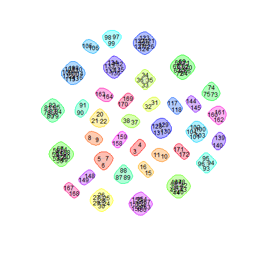

# Bundle claims into episodes

**Problem**
Claims need to be bundled together into episodes of care.
Each claim has a service start and service end date.
We need to determine if the end of one claim is *close* to the start of another claim.

**Solution**
Use social network analysis tools.


Grab a dataset to play around with.
There's no crucial reason to use `data.table`.


```r
path <- file.path("E:", "DataRepository", "Medicaid", "Staged", "Test")
load(file.path(path, "claims.RData"), verbose=TRUE)
```

```
## Loading objects:
##   dtClaims
```

Sample IDs to make the test dataset smaller.


```r
set.seed(as.Date("2014-07-23"))
size <- 50
sampleID <- sample(unique(dtClaims$memberID), size, replace=FALSE)
```

Include only the service dates.
We only need these to bundle claims together.


```r
sample <- subset(dtClaims, memberID %in% sampleID, c("memberID", "dateFirstSvc", "dateLastSvc"))
```

Sort by ID and service dates.


```r
sample <- sample[order(sample$memberID, sample$dateFirstSvc), ]
```

Create a claim ID.
It's really just a row ID.


```r
sample$claimID <- seq(1, nrow(sample))
```

Get number of rows we're starting out with.
This is for error-checking later.


```r
nrow0 <- nrow(sample)
```

Do a cartesian merge.
I.e., create all possible pairwise combinations of claims.
Column names from the first claim in the pair are suffixed with `.x`.
Column names from the second claim in the pair are suffixed with `.y`.


```r
pairs <- merge(sample, sample, by="memberID")
names(pairs)
```

```
## [1] "memberID"       "dateFirstSvc.x" "dateLastSvc.x"  "claimID.x"     
## [5] "dateFirstSvc.y" "dateLastSvc.y"  "claimID.y"
```

If we think of the cartesian product as a matrix, then we only need the "upper triangle".
I.e., exclude the diagonal (pairs that include duplicated claims), and the "lower triangle" (pairs that are in reverse order of pairs in the "upper triangle").


```r
isUpperTriangle <- pairs$claimID.x < pairs$claimID.y
pairs <- pairs[pairs$claimID.x < pairs$claimID.y, ]
```

For each pair, calculate the time difference between the start of one claim and the end of the other claim.


```r
pairs$daysAfter <- difftime(pairs$dateFirstSvc.y, pairs$dateLastSvc.x, units="days")
```

Create a logical column indicating whether to bundle the pairs.


```r
pairs$isBundled <- pairs$daysAfter <= 30
```

Look at a few examples.
**Only do this in an interactive session.**


Use some social network analysis tools.
Generate a network graph of the bundled claims.
The node label is the claimID.


```r
require(igraph)
G <- graph.data.frame(pairs[pairs$isBundled == TRUE, c("claimID.x", "claimID.y")], directed=FALSE)
```

Detect communities with the edge betweenness algorithm.
This really doesn't do a whole lot since the communities are implied in the data structure.
**The `edge.betweenness.community` function conveniently creates memberships, which is very useful for creating an episode ID.**


```r
C <- edge.betweenness.community(G)
```

Plot a network graph only if sample size is not too big.
The node labels are the claim IDs.
The *communities* or *episodes* are bundled by color.


```r
if (size <= 50) {
  plot(C,
       G,
       vertex.label.color="black",
       vertex.label.family="sans",
       vertex.frame.color=NA,
       vertex.color=NA,
       vertex.size=0,
       edge.color="grey")
}
```

 

Create a data frame for community membership.
In our case, *community* is synonymous with the concept of episode.


```r
membership <- data.frame(claimID = as.numeric(names(membership(C))), episodeID = membership(C))
```

Add a column for `episodeID`, defined as the community membership.


```r
sample <- merge(sample, membership, by="claimID", all.x=TRUE)
```

Make sure we ended up with the same number of rows as we started with.


```r
message(sprintf("Is the number of rows the same as when we started? %s", identical(nrow0, nrow(sample))))
```

```
## Is the number of rows the same as when we started? TRUE
```

Look at a few examples.
**Only do this in an interactive session.**


